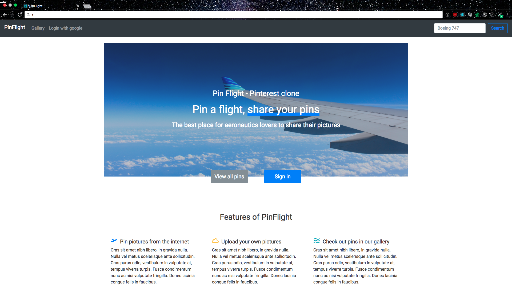
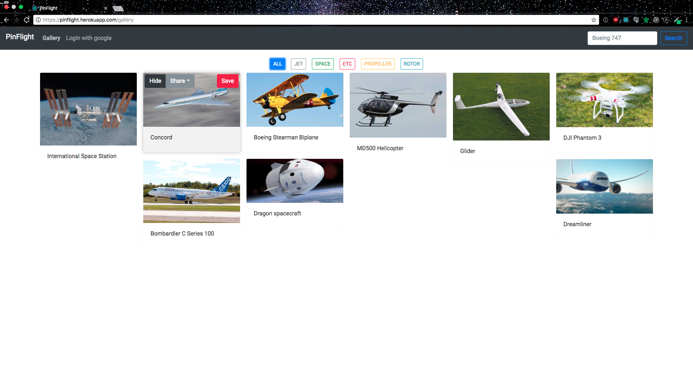
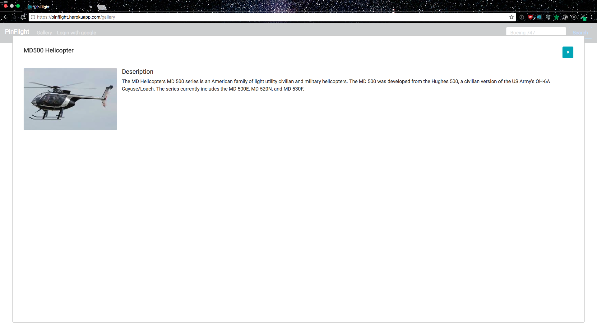

# Pinflight
PinFlight is a Pinterest clone which allows users to upload flight related images to the gallery.  
Uploaded images will be viewable by all visitors of the site.  
Logged in users have additional functionalities unlocked - uploading images, editing images, hiding images from gallery.

## Visit
Deployed on heroku at  [PinFlight](https://pinflight.herokuapp.com/gallery)

## Screenshots

## License
PinFlight is Copyright © 2017 Stefan Jiang. It is free software, and may be redistributed without restrictions.
